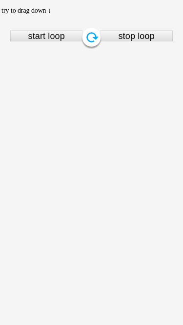

# dragRefresh
**Sorry,It's no English document yet.I will finish it soon**

#  下拉刷新插件
这个插件主要是为了解决拖拽、循环、回退过程中的动画问题。**并不包含**“请求数据”和“处理回调数据”等问题
## 如何使用 内置风格：
目前内置了两种风格：material design风格和 整个页面下拉的风格
首先引入jQuery文件和插件文件：
```html
<!-- css -->
<link rel="stylesheet" href="../css/dragRefresh.css" charset="utf-8">
<!-- jquery -->
<script type="text/javascript" src="http://cdn.bootcss.com/jquery/3.1.1/jquery.js"></script>
<!-- dragRefresh -->
<script type="text/javascript" src="../js/dragRefresh.js">
```

然后根据你想要的风格进行初始化，比如material design风格：


```javascript
$.DragRefresh.material()；
```

或者整个页面下拉风格：


```javascript
$.DragRefresh.body();
```
**注意：使用此风格必须保证body的position为relative，插件只是简单地改变top属性的值**


## 自定义动画：
同上，需要jquery,以及插件文件:
```html
<!-- jquery -->
<script type="text/javascript" src="http://cdn.bootcss.com/jquery/3.1.1/jquery.js"></script>
<!-- dragRefresh -->
<script type="text/javascript" src="../js/dragRefresh.js">
```

然后选定一个进行初始化:
```javascript
$(sclector).dragRefresh(options);
```
## 初始化参数：
<table>
    <tr>
        <td>名称</td><td>说明</td><td>类型</td><td>默认值</td>
    </tr>
    <tr>
        <td>top</td><td>选中的element的位置，ready状态或者reset状态会被在此位置</td><td>int</td><td>0</td>
    </tr>
    <tr>
        <td>loopY</td><td>当element被向下拖拽超过这个位置时，将被视为进入loop状态，否则视为取消</td><td>int</td><td>200</td>
    </tr>
    <tr>
        <td>bottom</td><td>element所被允许拖拽的最低位置</td><td>int</td><td>300</td>
    </tr>
    <tr>
        <td>loopFPS</td><td>进入looping状态后，将以每秒loopFPS的频率调用此函数来更新动画</td><td>int</td><td>24</td>
    </tr>
    <tr>
        <td>stateCss</td><td>设置各个状态的css类名</td><td>函数</td><td>
        function(state) {
            if (state) {
                return "state-" + state;
            } else {
                return "";
            }
        }</td>
    </tr>
    <tr>
        <td>onReady</td><td>插件初始化完成后调用的回调函数</td><td>函数</td><td>function() {}</td>
    </tr>
    <tr>
        <td>move</td><td>定义了手指移动距离与element移动距离的关系</td><td>函数</td><td>function(distance) {
            return distance;
        }</td>
    </tr>
</table>

## 监听事件：
<table>
<tr>
    <td>名称</td><td>说明</td><td>参数</td>
</tr>

<tr>
    <td>ready</td><td>插件在被初始化完成之后触发的事件，但是请注意，如果想要在外部监听这个事件的话，由于顺序问题可能无法正常触发，目前有两种途径：一种是通过options提供的onReady函数进行回调，一种是先绑定监听事件再去初始化插件</td><td>无</td>
</tr>


<tr>
    <td>release</td><td>手指离开屏幕时触发</td><td>无</td>
</tr>
<tr>
    <td>reset</td><td>插件回到最开始位置的时候触发</td><td>无</td>
</tr>
<tr>
    <td>dragging</td><td>拖拽过程中触发，在拖拽过程中会触发多次。</td><td>process：拖拽进度的百分比[0-100]</td>
</tr>
<tr>
    <td>retreating</td><td>从release状态到loop状态和 从release状态到reset状态过程中多次触发，用来更新动画</td><td>process：回退进度的百分比[0-100]</td>
</tr>
<tr>
    <td>loop</td><td>开始循环动画之前触发</td><td>无</td>
</tr>
<tr>
    <td>looping</td><td>进入循环状态后，以每秒loopFPS次的频率触发，用来更新动画</td><td>无</td>
</tr>

</table>

## 常见问题：
* 图标从哪来的？有版权限制吗？
    * 图标是从谷歌的网站上下载下来的：https://material.io/icons/ （自带梯子）我只是改了个颜色。
* 为什么不用prototype的方式书写？
    * 首先，这个插件一般来说一个页面上只会有一个，所以即使不使用prototype也不会有太多性能问题。
    * 其次，使用prototype就不可避免的会把私有的变量暴露在外面。
    * 然后，使用prototype可读性太差，我写到一半发现我自己都不知道在写些什么。。。
    * 最后，如果到了不得不需要prototype的时候，我会用prototype重构一遍。
